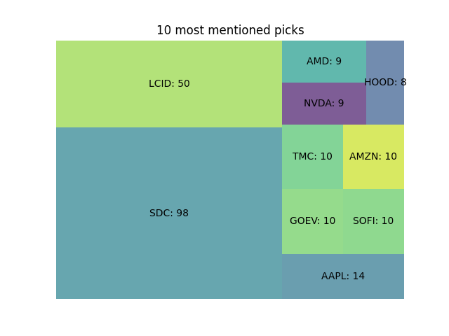
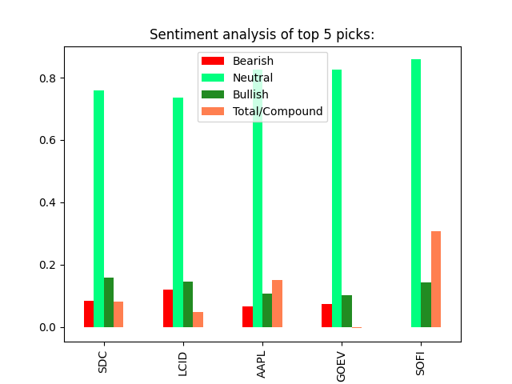

# sentiment-analysis
This script scrapes the comments of stock subreddits and uses natural language processing to assign a sentiment score to the tickers mentioned.

Code adapted from github:asad70

Plots for mentions and sentiment are named mentions.png and sentiment.png, respectively.

# Usage
First install requirements then run data.py followed by sentiment_analysis.py.

```bash
pip install -r requirements.txt
python3 data.py
python3 sentiment_analysis.py
```

# Sample Output
It took 489.21 seconds to analyze 5310 comments in 87 posts in 4 subreddits.

Posts analyzed saved in titles

10 most mentioned picks:\ 
SDC: 98\
LCID: 50\
AAPL: 14\
GOEV: 10\
SOFI: 10\
TMC: 10\
AMZN: 10\
NVDA: 9\
AMD: 9\
HOOD: 8\

Sentiment analysis of top 5 picks:\
     &nbsp;&nbsp;&nbsp; &nbsp; &nbsp; &nbsp;Bearish &nbsp;Neutral &nbsp;Bullish &nbsp;Total/Compound
SDC    &nbsp; 0.084   &nbsp;&nbsp; 0.758   &nbsp;&nbsp;&nbsp; 0.158          0.082\
LCID   &nbsp; 0.120   &nbsp;&nbsp; 0.736   &nbsp;&nbsp;&nbsp; 0.145          0.048\
AAPL   &nbsp; 0.067   &nbsp;&nbsp; 0.825   &nbsp;&nbsp;&nbsp; 0.108          0.150\
GOEV   &nbsp; 0.073   &nbsp;&nbsp; 0.825   &nbsp;&nbsp;&nbsp; 0.102         -0.004\
SOFI   &nbsp; 0.000   &nbsp;&nbsp; 0.858   &nbsp;&nbsp;&nbsp; 0.142          0.307\


